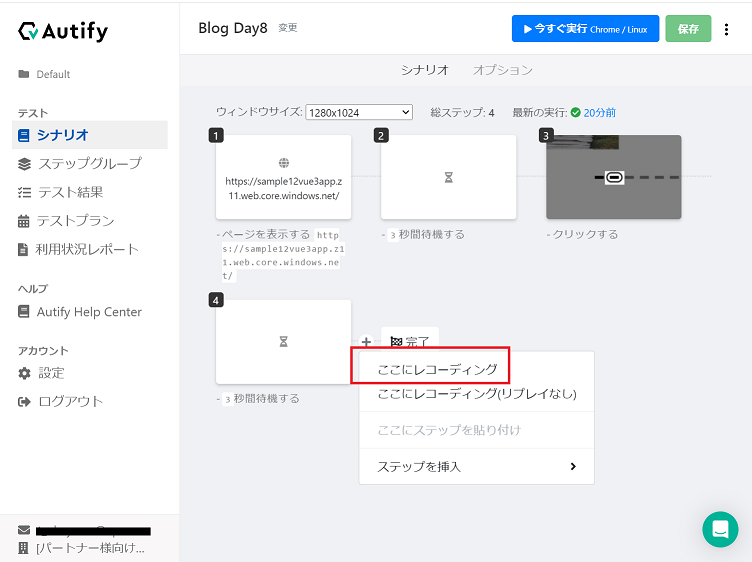
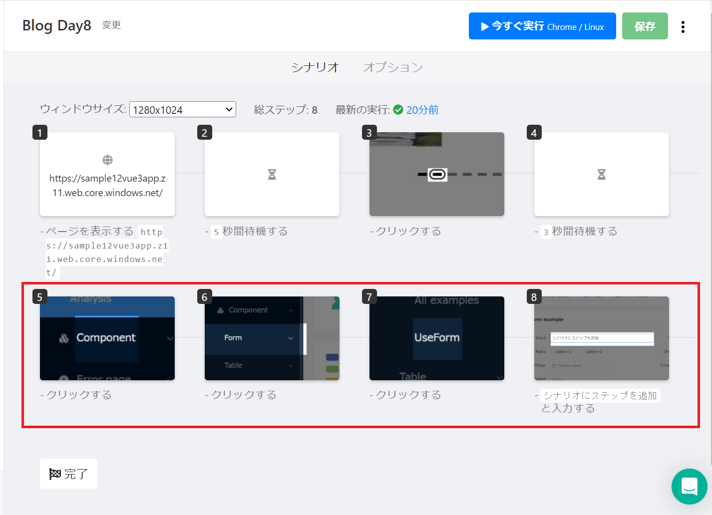
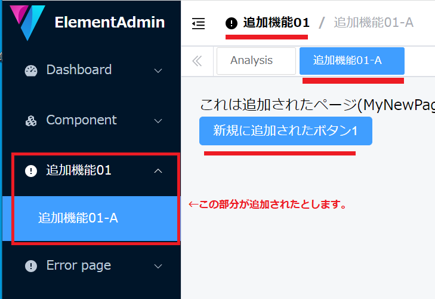
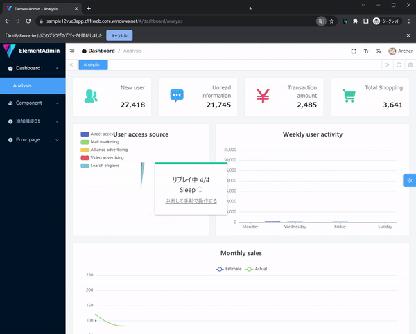

Autify連載Day8：テストシナリオの編集

# はじめに

こんにちは、ACS 事業部の奥山です。

前回のDay7では、「メールテスト機能について」についてご紹介しました。

[https://techblog.ap-com.co.jp/entry/2023/12/11/170203:embed:cite]

第８回(最終回)では「ローカルリプレイ」、「テストシナリオの編集容易性」について紹介します。

# テストシナリオの編集

E2Eテストにおいてシナリオは一度作成して完成ではありません。テストを実施していると機能の追加、変更、削除などでシナリオを必要に応じて正しく修正する必要が出てきます。

実際のテスト作業は`実行` => `確認` => `(必要あれば)シナリオの修正`を繰り返しになります。

  

シナリオの品質はテストにとって最も重要な要素の一つです。品質の高いテストシナリオを作成・維持するためには、編集が容易であることが求められます。Autifyではテストシナリオの編集はプログラミングの知識がなくてもGUI操作で簡単に行えます。

## ローカルリプレイ（ここにレコーディング）

公式の[説明はこちら](https://help.autify.com/docs/ja/local-replay?highlight=%E3%83%AD%E3%83%BC%E3%82%AB%E3%83%AB%E3%83%AA%E3%83%97%E3%83%AC%E3%82%A4)になります。
追加したいシナリオの位置まで自動で移動してくれる便利な機能になります。

操作は非常に簡単で追加したい位置で「ここにレコーディング」をクリックするだけです。

実際に動いているところを見てみましょう。

ブラウザが立ち上がり、自動でログインして、指定した位置（今回の場合は4番目のステップ）まで移動しレコーディングを開始します。
ステップとして追加したい操作を行い「完了」をクリックします。

赤枠で囲った部分が追加されました。簡単ですね。
長いシナリオを編集する場合、この機能は非常に便利です。

## テストシナリオの編集（追加）も簡単

メニューに「新しい機能(※赤枠部分)」が追加されたことを想定して、シナリオを変更してみます。  
※今回の検証のサンプルアプリには [vue-element-plus-admin](https://github.com/kailong321200875/vue-element-plus-admin)を利用しています。

手順としては、
1. 「ローカルリプレイ」を利用して追加したい箇所までシナリオを移動します。
　※今回はログイン直後に新規ステップを追加します。
2. 「新規機能」の確認用のステップを追加します。
　(ボタンをクリックして表示される内容を確認)

実際に追加している様子は以下のようになります。

簡単ですね。GUIの操作のみで新機能に対応したシナリオに変更できてしまいました。

このようにプログラミングの知識がなくても、簡単にシナリオを変更できるのはAutifyの強みです。

全８回のブログでAutifyの魅力をお伝えしてきましたが、今回でひとまず最終回となります。
Autifyにはまだまだ紹介できていない魅力的な機能がたくさんあります。E2Eテストの自動化に興味がある方は是非一度お試し頂く価値があると思います。
最後までお読みいただきありがとうございました。

# 最後に

私達 ACS 事業部は Azure・AKS を活用した内製化のご支援をしております。ご相談等ありましたらぜひご連絡ください。

[https://www.ap-com.co.jp/cloudnative/?utm_source=blog&utm_medium=article_bottom&utm_campaign=cloudnative:embed:cite]

また、一緒に働いていただける仲間も募集中です！  
切磋琢磨しながらスキルを向上できる、エンジニアには良い環境だと思います。ご興味を持っていただけたら嬉しく思います。

[https://www.ap-com.co.jp/recruit/info/requirements.html?utm_source=blog&utm_medium=article_bottom&utm_campaign=recruit:embed:cite]

<fieldset style="border:4px solid #95ccff; padding:10px">
本記事の投稿者: [奥山 拓弥](https://techblog.ap-com.co.jp/archive/author/mountain1415)  
</fieldset>
