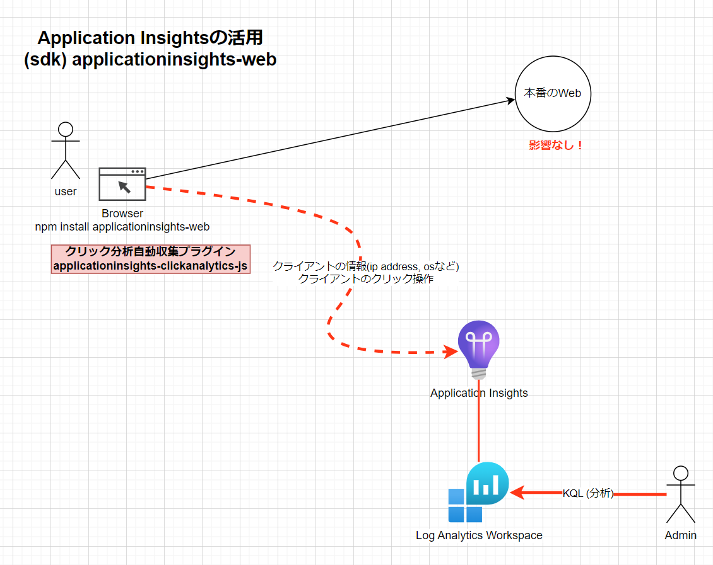

Azure でリアル ユーザー監視(RUM) (Application Insights) x Vue.js (3.0)

# はじめに

こんにちは、ACS 事業部の奥山です。

今回はAzure Application Insights を利用した「リアル ユーザー監視」の紹介です。
※Application Performance Monitoring(APM)とも呼ばれます。最近利用する機会がありましたので、備忘録を兼ねて簡単にブログにしておきます。

Azure Application Insights を利用して、監視データ（ユーザー操作）を収集することでWebサイトやWebアプリの利用状況を分析しサービスの改善に役立てることができます。
簡単に導入できますので、Webアプリに是非導入したい機能です。

# 仕組み（簡単に）


上記のようにブラウザにJavaScript SDKを埋め込むことで、監視データ（ページ遷移、ユーザー操作など）を本番環境に影響を与えずに収集します。

今回は Microsoft から提供されている以下の２つのSDKを利用します。
- @microsoft/applicationinsights-web
- @microsoft/applicationinsights-clickanalytics-js


## Webアプリ（Vue3 + TypeScript）に導入
### 1. 必要なAzureリソースを作成する
Azureに必要なリソース（Log Analytics Workspace, Application Insights）を作成し、接続文字列を取得しておきます。

以下は Azure CLI での作成例です。もちろんAzureのポータルから作成しても構いません。

```bash
# log analytics workspaceの作成
export WORKSPACE_NAME=sample-logw
az monitor log-analytics workspace create -g $RG_NAME --workspace-name $WORKSPACE_NAME

# application insightsの作成
export APPINSIGHTS_NAME=sample-ai
az monitor app-insights component create --app $APPINSIGHTS_NAME --location $LOCATION --kind web -g $RG_NAME --application-type web --workspace $WORKSPACE_NAME

# Application Insights 接続文字列の取得
export MYAPPINSIGHTS_CONNECTSTRING=$(az monitor app-insights component show --subscription $SUBSCRIPTION_ID --resource-group $RG_NAME --app $APPINSIGHTS_NAME --query connectionString --output tsv)
```
※リソースグループの作成、環境変数の設定等は省略しています。  
※MYAPPINSIGHTS_CONNECTSTRING をWebアプリに設定します。  

### 2. Webアプリ（Vue3 + TypeScript）
Webアプリ（Vue3 + TypeScript）に必要なSDKをインストールします。
```bash
npm i --save @microsoft/applicationinsights-web
npm i --save @microsoft/applicationinsights-clickanalytics-js
```

main.ts
```
```

MyComponet.vue
```
<script setup lang="ts">
import { inject } from 'vue'
import { IApplicationInsights } from '@microsoft/applicationinsights-web'
//import { ref } from 'vue'

defineProps<{ msg: string }>()

const appInsights = inject<IApplicationInsights>('appInsights')

const clickDiv = () => {
  console.log('div click!')
  if (appInsights) {
    appInsights.trackEvent({ name: 'my-customEvent-clickButtonFn' });
  }
}

<template>
:
  <!-- button -->
  <h2>data-idで指定</h2>
  <button data-id="my-btn001">my-btn001</button>
  <div data-id="my-div001">
    <button data-id="my-btn002">my-btn002</button>
  </div>
  <button data-id="my-btn003">my-btn003</button>

  <p>div clickイベント</p>
  <div @click="clickDiv">div click button4</div>
  <div @click="clickDiv">div click button5</div>
  <div @click="clickDiv">div click button6</div>
</template>

<style scoped>
.read-the-docs {
  color: #888;
}
</style>

```
## Azureダッシュボードで確認してみる（KQL利用）
簡単なKQLを書くことで、Webアプリの利用状況を確認することができます。

# まとめ
いかがでしたでしょうか？ さほど手間をかけずに導入できる機能であることがわかりました。
「リアル ユーザー監視」(Application Performance Monitoring(APM)) は多くのユーザーが利用するWebサイトやWebアプリには必須の機能です、Azureを利用している場合は Appliction Insights は是非導入したい機能です。

# 最後に
私達 ACS 事業部は Azure・AKS を活用した内製化のご支援をしております。ご相談等ありましたらぜひご連絡ください。

[https://www.ap-com.co.jp/cloudnative/?utm_source=blog&utm_medium=article_bottom&utm_campaign=cloudnative:embed:cite]

また、一緒に働いていただける仲間も募集中です！  
切磋琢磨しながらスキルを向上できる、エンジニアには良い環境だと思います。ご興味を持っていただけたら嬉しく思います。

[https://www.ap-com.co.jp/recruit/info/requirements.html?utm_source=blog&utm_medium=article_bottom&utm_campaign=recruit:embed:cite]

<fieldset style="border:4px solid #95ccff; padding:10px">
本記事の投稿者: [奥山 拓弥](https://techblog.ap-com.co.jp/archive/author/mountain1415)  
</fieldset>
